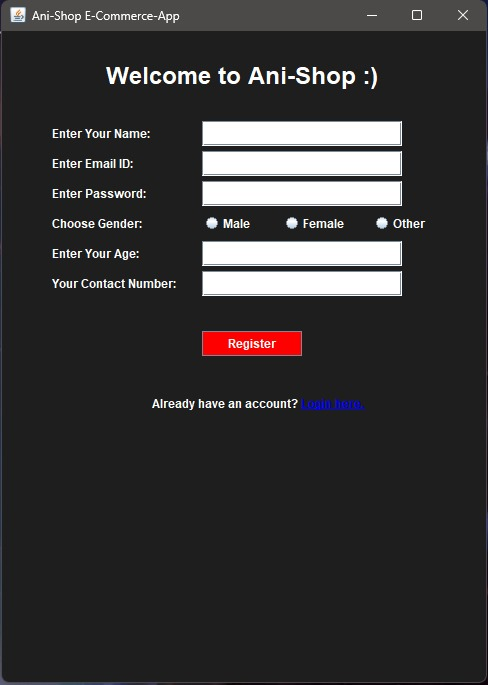
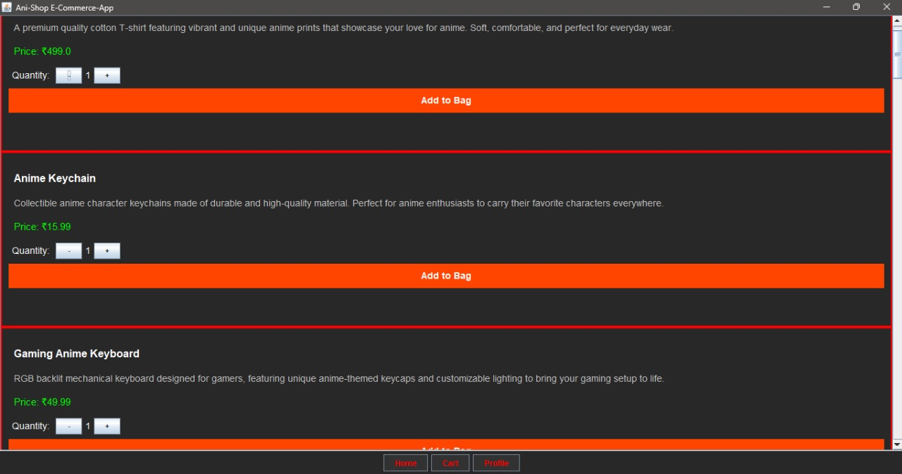
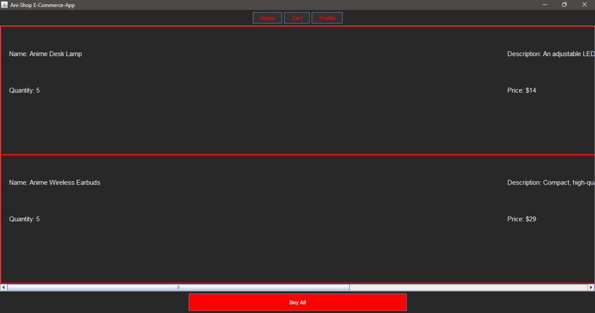
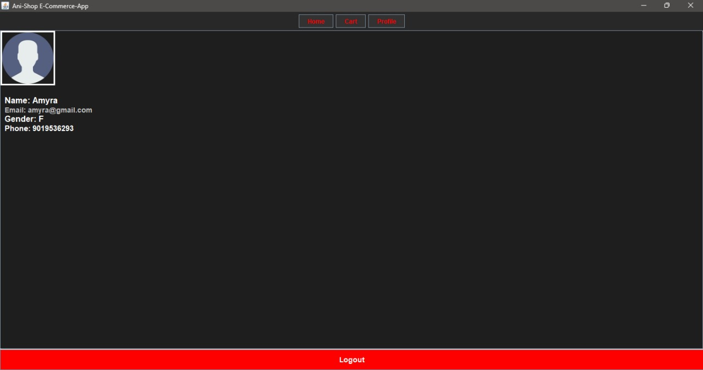

# 🎌 Ani-Shop: Anime-Themed E-commerce Platform 🎌

## 📖 Introduction  
**Ani-Shop** is a desktop-based e-commerce application specially designed for anime enthusiasts. Whether you're looking for anime-themed clothing, books, or unique merchandise, Ani-Shop provides a seamless shopping experience with its intuitive user interface and robust backend functionality.

---

## 🌟 Features & Functionalities  
### 1. 🔒 **User Authentication**  
- 📝 **Signup & Login Forms**  
  - New users can register by providing essential details.  
  - Existing users can securely log in.  
  - Validation mechanisms ensure secure access.

### 2. 🛍️ **Product Listing**  
- Users are greeted with a well-organized product listing page after login.  
- Each product includes essential details like name, description, and price.

### 3. 🛒 **Cart Management**  
- Add products to the cart and review selections effortlessly.  
- View product quantities, total price, and manage selections.  
- Proceed with purchases using the **Buy** option.

### 4. 👤 **User Profile**  
- A dedicated section to view user details like name, email, and account-related information.

---

## 🛠️ Technologies Used  

### 🎨 **Frontend**  
- Java Swing for a responsive and interactive graphical user interface (GUI).  

### ⚙️ **Backend**  
- Java for core application logic, ensuring smooth and efficient processing.  

### 🗄️ **Database**  
- MySQL to store and manage user information, product details, and transaction records.  

### 🔗 **Database Connectivity**  
- JDBC (Java Database Connectivity) for dynamic data fetching and updates between the app and the database.

---

## 🚀 How to Run the Project  
1. **Clone the Repository**  
   ```bash
   git clone https://github.com/your-username/Ani-Shop.git
   cd Ani-Shop
   ```

2. **Setup the Database**  
   - Install MySQL and create a database using the provided schema.  
   - Import all files from sql package from the repository.  

3. **Run the Application**  
   - Open the project in your favorite IDE.  
   - Build and run the application to launch Ani-Shop.  

---

## 📸 Screenshots  
Here are some snapshots of the Ani-Shop application:  


### 🔑 Registration Page  


### 🛍️ Product Listing  


### 🛒 Cart  


### 👤 User Profile  



---

## 🧑‍💻 Developer Notes  
- Feel free to enhance the application by adding more anime-themed products or features like payment gateways, order history, and wishlist management.  
- Contributions are welcome!  

---

## 📝 Conclusion  
**Ani-Shop** combines intuitive design with efficient backend functionality to create a reliable and scalable shopping platform for anime fans. Explore the world of anime merchandise with Ani-Shop and enjoy a seamless shopping experience.  

---

## 🏷️ License  
This project is licensed under the MIT License. See the LICENSE file for details.  

---

## 🙌 Acknowledgments  
Special thanks to the anime community for inspiring this project.  

---

### 👾 **Happy Shopping!**  
